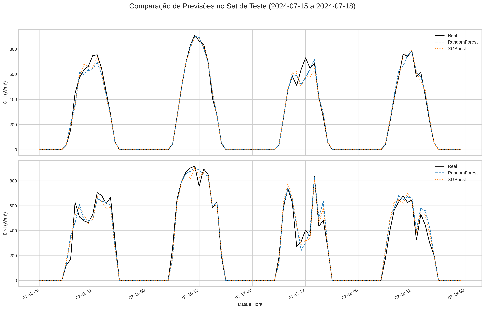
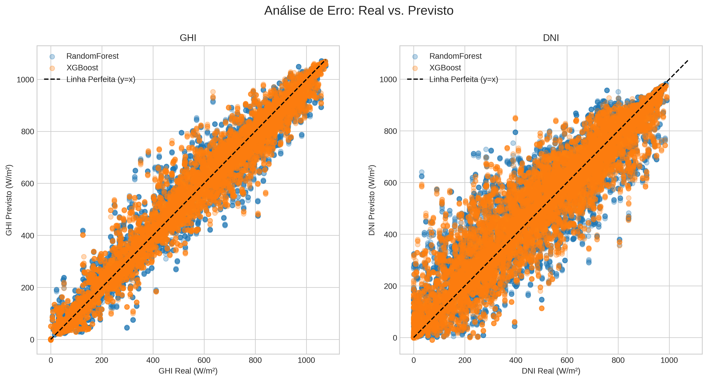
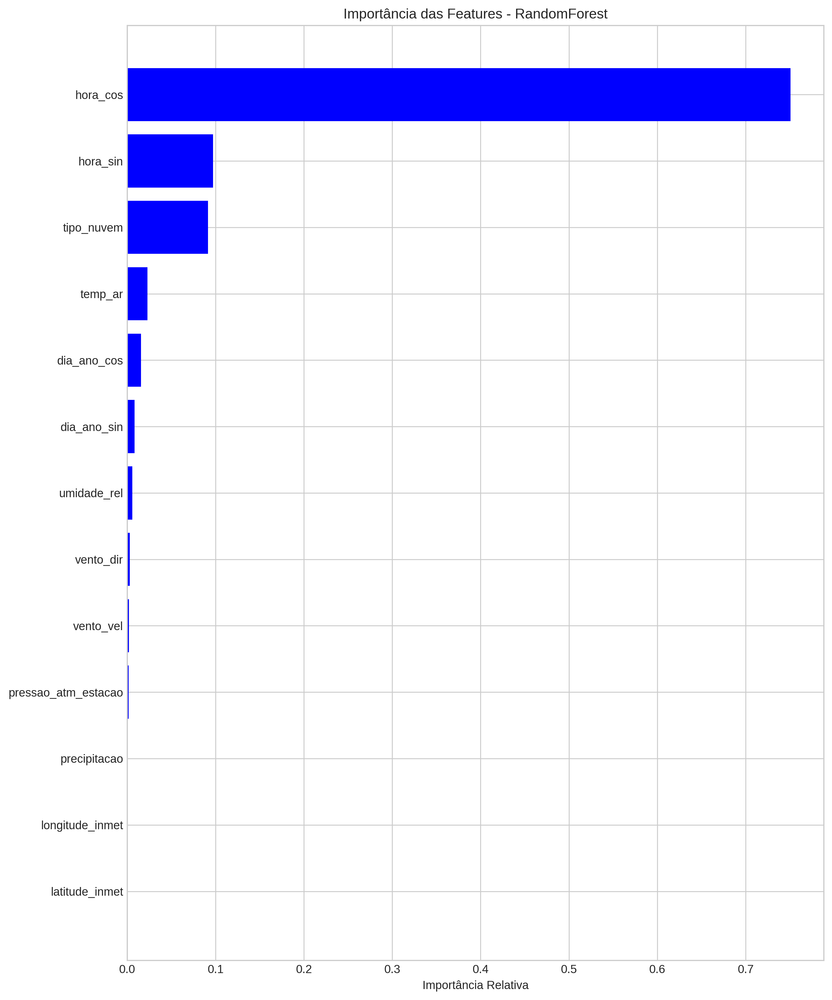

# Projeto de Previsão de Irradiação Solar do RN com Machine Learning

## Sobre os Dados

A base deste projeto é a construção de um dataset robusto e unificado, combinando medições meteorológicas de estações terrestres com dados de irradiação solar modelados por satélite. O objetivo é criar um conjunto de dados limpo e consistente, pronto para o treinamento de modelos preditivos.

### 1. Fontes de Dados

Foram utilizadas duas fontes primárias de dados para compor o dataset final:

* **Instituto Nacional de Meteorologia (INMET):**
    * **O que são:** Dados horários de múltiplas estações meteorológicas automáticas espalhadas pelo Brasil.
    * **Papel no Projeto:** Fornecem as **features (preditores)** do nosso modelo. São medições "ground truth" de variáveis como:
        * Temperatura do Ar (`temp_ar`)
        * Umidade Relativa (`umidade_rel`)
        * Pressão Atmosférica (`pressao_atm_estacao`)
        * Velocidade e Direção do Vento (`vento_vel`, `vento_dir`)
     
    Foram usadas as quatro estações do RN com mais dados de 2018 a 2024:
    - Natal
    - Caicó
    - Ipanguaçu
    - Apodi

* **National Solar Radiation Database (NSRDB):**
    * **O que são:** Dados horários de irradiação solar e variáveis meteorológicas modeladas, derivados de imagens de satélite.
    * **Papel no Projeto:** Fornecem nossas **variáveis-alvo (targets)** e também servem como fonte de apoio para a limpeza de dados. As principais variáveis utilizadas foram:
        * Irradiância Horizontal Global (`ghi`)
        * Irradiância Normal Direta (`dni`)
        * Dados meteorológicos modelados (`temp_ar_nsrdb`, etc.)

A correspondência entre as fontes foi feita utilizando as coordenadas geográficas (latitude e longitude) exatas de cada estação do INMET.

### 2. Processo de Tratamento e Limpeza

Os dados brutos de ambas as fontes passaram por um pipeline rigoroso de tratamento para garantir sua qualidade e consistência. As seguintes etapas foram executadas:

1.  **Consolidação e Unificação:** Os múltiplos arquivos CSV, separados por estação e por ano, foram carregados, processados e unificados em dois DataFrames principais: um para o INMET e outro para a NSRDB.

2.  **Remoção de Duplicatas (Deduplicação):** Durante a análise, foi identificado um problema crítico de múltiplas leituras para o mesmo `timestamp` e `codigo_estacao`. A correção foi feita agrupando os dados pela chave `(timestamp, codigo_estacao)` e calculando a **média** dos valores, garantindo uma única observação por local e hora.

3.  **Tratamento de Anomalias (Dados de Irradiação):** Foram detectadas anomalias nos dados da NSRDB, onde os valores de GHI/DNI caíam para zero de forma implausível durante o dia. Esses pontos foram:
    * Identificados por meio de um limiar (`GHI < 10 W/m²` durante o dia).
    * Marcados como valores nulos (`NaN`).
    * Preenchidos utilizando **interpolação temporal** (`method='time'`), resultando em uma série temporal mais suave e fisicamente coerente.

O resultado deste processo é um DataFrame único e limpo, alinhado no tempo, com os dados meteorológicos do INMET já corrigidos e os dados de irradiação da NSRDB servindo como alvo.

## Treinamento dos Modelos

Com um dataset limpo e enriquecido, a fase de modelagem foi iniciada com o objetivo de comparar diferentes algoritmos de Machine Learning e encontrar o mais performático para a tarefa de prever a irradiação solar.

### 1. Metodologia de Avaliação

#### Separação dos Dados (Splitting)

Para garantir uma avaliação justa e evitar o vazamento de dados (*data leakage*), uma abordagem de **divisão cronológica** foi adotada, o que é fundamental para problemas de séries temporais. O dataset foi dividido em três conjuntos distintos e sequenciais:

* **Conjunto de Treino (2018 - 2022):** Uma janela de 5 anos de dados utilizada para ensinar os modelos a aprender os padrões entre as features meteorológicas e a irradiação solar.
* **Conjunto de Validação (2023):** Um ano completo de dados que os modelos não viram durante o treino. Este conjunto foi utilizado para a otimização de hiperparâmetros.
* **Conjunto de Teste (2024):** O ano mais recente de dados, completamente isolado do processo de treino e otimização. Ele serve como o "juiz final" para aferir o desempenho real e imparcial do modelo campeão em dados novos.

### 2. Benchmark de Modelos

Dois dos algoritmos de regressão baseados em árvores mais poderosos para dados tabulares foram selecionados para o benchmark:

* **RandomForest Regressor:** Um modelo de *ensemble* que utiliza a técnica de *bagging*. Ele treina múltiplas árvores de decisão em diferentes subconjuntos de dados e combina suas previsões (calculando a média) para gerar um resultado mais robusto e menos propenso a overfitting. Serviu como nosso sólido modelo de **baseline**.

* **XGBoost (Extreme Gradient Boosting):** Um modelo de *ensemble* que utiliza a técnica de *boosting*. Ele constrói árvores de decisão de forma sequencial, onde cada nova árvore é treinada para corrigir os erros da anterior. É conhecido por sua alta performance e eficiência computacional.

### 3. Otimização de Hiperparâmetros com `RandomizedSearchCV`

Os parâmetros padrão de um modelo raramente são os ideais para um problema específico. Para extrair a performance máxima tanto do RandomForest quanto do XGBoost, foi empregada uma técnica de otimização chamada **Busca Aleatória de Hiperparâmetros** (`RandomizedSearchCV` do Scikit-learn).

Essa abordagem foi escolhida por ser mais eficiente que uma busca exaustiva (*Grid Search*). Em vez de testar todas as combinações possíveis, a Busca Aleatória testa um número fixo de combinações aleatórias dentro de um espaço de busca pré-definido, frequentemente encontrando uma configuração de alta performance em uma fração do tempo.

O processo foi executado em uma amostra do conjunto de treino para agilizar a experimentação e otimizado para a métrica de Erro Quadrático Médio.

#### Hiperparâmetros Otimizados para **RandomForest**:
* `n_estimators`: Número de árvores na floresta.
* `max_depth`: Profundidade máxima de cada árvore.
* `max_features`: Fração de features a serem consideradas ao procurar a melhor divisão.
* `min_samples_split`: Número mínimo de amostras para dividir um nó interno.
* `min_samples_leaf`: Número mínimo de amostras em um nó folha (regularização).

#### Hiperparâmetros Otimizados para **XGBoost**:
* `n_estimators`: Número de rodadas de boosting (árvores).
* `learning_rate`: Fator de encolhimento que reduz a contribuição de cada árvore, prevenindo overfitting.
* `max_depth`: Profundidade máxima de cada árvore.
* `subsample`: Fração de amostras de treino a serem usadas para cada árvore.
* `colsample_bytree`: Fração de features a serem usadas para cada árvore.

Após encontrar a melhor combinação de parâmetros para cada modelo, eles foram retreinados no conjunto de treino completo e avaliados no conjunto de teste para obter os resultados finais de performance.

## Resultados

Após o treinamento e a otimização, os modelos foram submetidos a uma avaliação final rigorosa utilizando o **conjunto de teste (ano de 2024)**, um período de dados completamente novo que não foi utilizado em nenhuma etapa anterior do processo. Esta seção detalha o desempenho quantitativo e qualitativo dos modelos finalistas.

### 1. Desempenho Quantitativo

As métricas de Erro Médio Absoluto (MAE), Raiz do Erro Quadrático Médio (RMSE) e o Coeficiente de Determinação (R²) foram calculadas para comparar a performance dos modelos. O MAE, por ser de fácil interpretação (o erro médio em W/m²), é a métrica primária para a comparação.

A tabela abaixo resume o desempenho do **RandomForest (com features de lag/rolling)** e do **XGBoost Otimizado**:

| Modelo | Alvo | MAE (W/m²) | RMSE (W/m²) | R² |
| :--- | :--- | :--- | :--- | :--- |
| **RandomForest** | GHI | 18.80 | 44.81 | 0.982 |
| | DNI | 38.08 | 79.65 | 0.941 |
| **XGBoost Otimizado** | **GHI** | **16.05** | **36.73** | **0.984** |
| | **DNI** | **31.61** | **65.72** | **0.946** |

**Análise:**
O processo de otimização de hiperparâmetros do **XGBoost** se mostrou altamente eficaz, resultando em um modelo superior em todas as métricas para ambos os alvos. A redução do MAE para o GHI em mais de 21% em relação ao baseline inicial demonstra o sucesso da abordagem. Ambos os modelos apresentaram um altíssimo R², indicando que conseguem explicar mais de 98% da variabilidade do GHI e mais de 94% da variabilidade do DNI.

### 2. Análise Visual do Desempenho

Para uma avaliação qualitativa, foram gerados gráficos comparando as previsões dos modelos com os valores reais.

#### Comparação de Séries Temporais

O gráfico abaixo exibe as previsões em um período de três dias do conjunto de teste. É possível observar a alta aderência de ambos os modelos à curva real, capturando tanto o ciclo diário quanto as variações causadas pela nebulosidade.

#### Análise de Erro (Dispersão)

O gráfico de dispersão plota os valores previstos contra os valores reais. Uma previsão perfeita resultaria em todos os pontos caindo sobre a linha diagonal tracejada. A concentração de pontos ao longo desta linha demonstra a alta acurácia geral dos modelos.

### 3. Importância das Features

Uma das análises mais importantes é entender *quais informações* os modelos consideraram mais úteis para fazer suas previsões. Os gráficos abaixo mostram as 20 features mais importantes para o RandomForest e para o XGBoost.

| RandomForest | XGBoost (Modelo GHI) |
| :---: | :---: |
|  | .png) |

**Análise:**
Ambos os modelos concordam de forma esmagadora sobre as features mais preditivas:
* **Features Cíclicas (`hora_cos`, `dia_ano_sin`, etc.):** A alta importância destas features confirma que o modelo aprendeu com sucesso os ciclos diários e sazonais.
* **Features meteorológicas (`tipo_nuvem`, `temp_ar`):** O tipo da nuvem, a temperatura do ar e a umidade relativa se mostraram features que alteram a insolação média, mudando os valores mensais de acordo com a estação do ano.
* **Coordenadas (`latitude_inmet`):** A latitude se mostrou relevante, indicando que o modelo aprendeu a generalizar as previsões com base na localização geográfica.

A alta importância dessas features projetadas valida o sucesso da etapa de Engenharia de Features.

### 4. Conclusão dos Resultados

Com base na análise quantitativa e qualitativa, o modelo **XGBoost** é declarado o campeão do benchmark, apresentando o menor erro e o melhor ajuste aos dados de teste. O projeto demonstrou com sucesso a viabilidade de prever a irradiação solar com alta precisão utilizando dados meteorológicos locais e uma robusta engenharia de features. Mesmo assim, o **Random Forest Regressor** também se mostrou um modelo excelente para a aplicação, sendo um forte concorrente.
